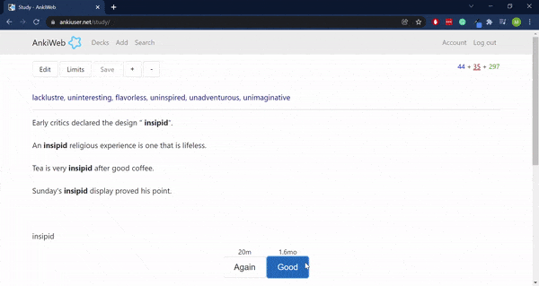

# English Vocabulary App

I've often found it difficult to remember new words in English that I come across, so I designed and developed a script that takes as input a list of words in English and outputs a deck of Anki flashcards that can be uploaded to your Anki account and used as studying material.

## Demo:

## Features:
* Multiple prompts on the front of each flashcard:
   * Synonyms
   * Example sentences
   * Dictionary definitions
   * First letter of the word
* Colour-coded design for easy reading

## Tools and technologies used:
* Python 3.7
  * BeautifulSoup
  * pandas
  * NLTK
  * genanki

## Challenges:
* Designing flashcards that give a sufficiently specific prompt for the word being tested
    * Given the number of synonyms in English, it was difficult to create cards that gave enough context about the given word for it to be clear which word was the correct answer. I decided to use as prompts a combination of synonyms, example sentences, dictionary definitions, and, at the bottom of the page, the first letter of the word.

## Credits:
* [Wiktionary, the free dictionary](https://en.wiktionary.org/wiki/Wiktionary:Main_Page)
* [Skell - Sketch Engine for language learning](https://skell.sketchengine.eu/#home?lang=en)
* [genanki](https://github.com/kerrickstaley/genanki)
* https://www.freecollocation.com/
